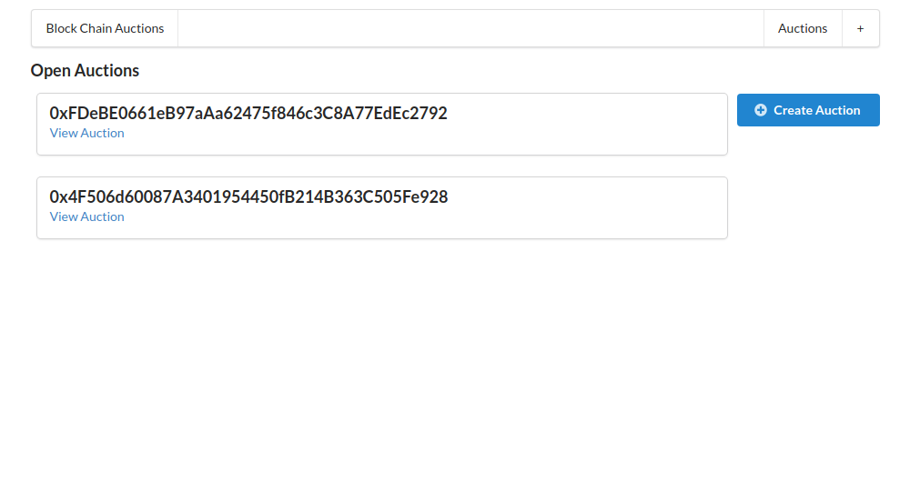
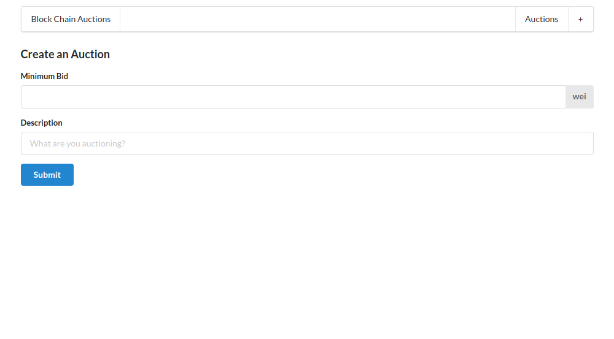
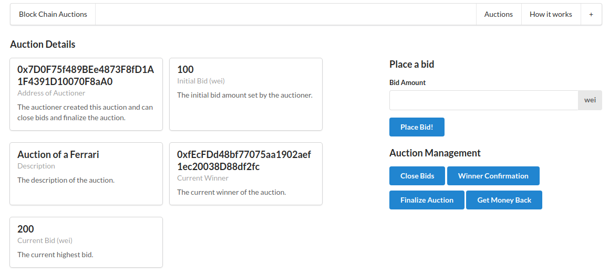

# Auction System on the Ethereum's Blockchain

This project is an auction system that uses the Ethereum's blockchain. It allows users to create and manage auctions and also to place bids.

## Screenshots

## Prerequisites

- Node.js v18.17.0 or greater

## API Key and Passphrase

Make sure to set your API Key and Passphrase in the web3.js, deploy.js and factory.js. Never commit them in production environments.

## Installation

npm install --legacy-peer-deps

## Compilation

cd ethereum
node compile.js

## Tests

npm run test

## Deploy

cd ethereum
node deploy.js

After deploying, copy the contract address and paste into the factory.js file.

## Server start up

npm run dev